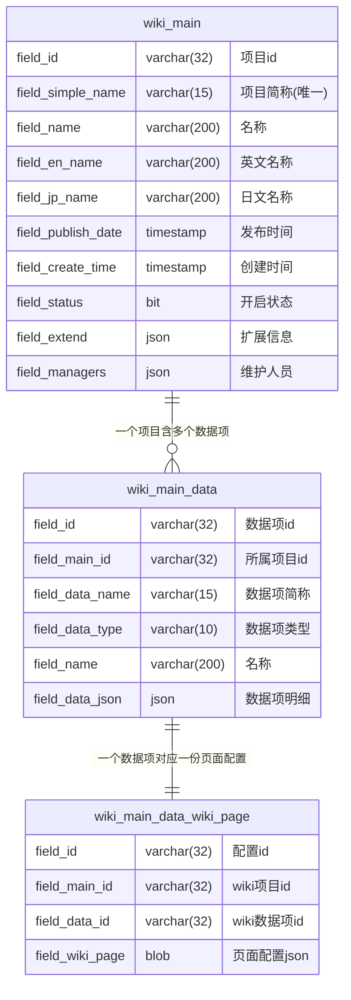
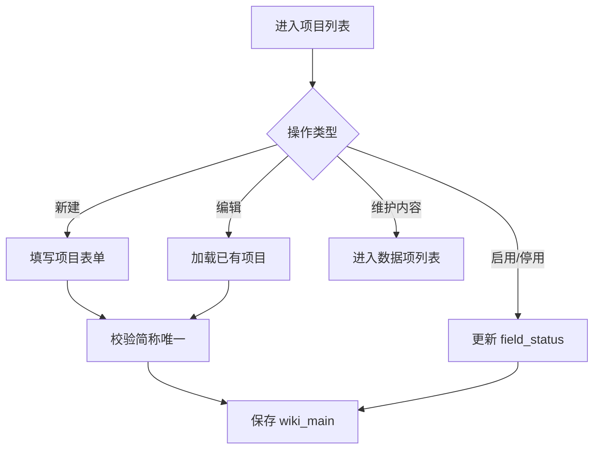
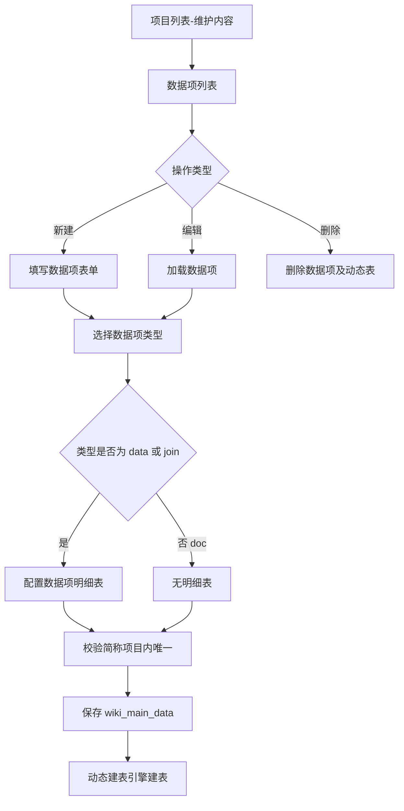
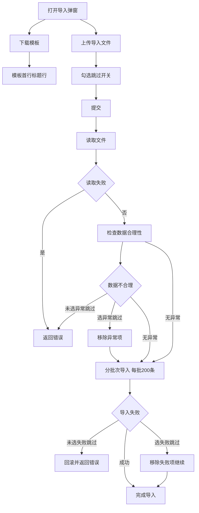

# wiki业务逻辑

> wiki 模块归属于 `com.wiki.admin.wiki` 包；模块标识 `admin-wiki`；模块名称 `wiki 模块`；
> 本文为 wiki 模块的业务逻辑文档，是项目、数据项、数据明细与 wiki 页面维护业务流程的上游设计。
> 通用流转规范遵循 [业务流转公共规范.md](../../common/业务流转公共规范.md)，不再重复编写。

---

## 0. 文档控制约定

### 0.1 AI 使用约定

- 标题层级和字段名保持稳定
- 所有不确定项写 `TBD`
- 所有不适用项写 `N/A（原因）`
- 所有分层职责、调用方向、异常处理路径显式列出
- 每条流转约定必须有唯一 `FLOW ID`

### 0.2 文档版本记录

| 文档版本 | 修改日期 | 修改人 | 修改说明 | 审核人 |
|----------|----------|--------|----------|--------|
| v0.1 | 2026-09-20 | | 初始版本创建 | |

---

## 1. 文档定位与输入依据

### 1.1 事实源策略

- **人类可读设计文档**: 本业务逻辑文档
- **机器可读契约文件**: N/A（业务流转不直接产出机器契约，由 API 设计文档与代码落地）
- **同步规则**: 本文档为 wiki 模块业务流程的上游设计，模块级 API 设计文档、数据库设计文档与代码实现需与本文档保持一致

### 1.2 事实源优先级

| 优先级 | 文档类型 | 冲突处理规则 |
|--------|----------|--------------|
| P0 | 本业务逻辑文档 | 业务流程、角色权限、异常处理以本文档为准 |
| P1 | [开发规范.md](../../AGENTS.md) / `docs/common/开发规范.md` | 仓库级总规范，本文件未覆盖项回退至此 |
| P2 | wiki 模块 API 接口设计文档 / 数据库设计文档 | 接口路径、表结构以对应专项文档为准 |
| P3 | [业务流转公共规范.md](../../common/业务流转公共规范.md) | 后端分层、跨服务调用以公共规范为准 |
| P4 | 代码现状 | 实现过程中发现的问题需同步更新本文档 |

### 1.3 适用范围

- **适用系统**: `admin`（后台管理系统）
- **适用包路径**: `com.wiki.admin.wiki`
- **适用调用方向**:
  - 前端 → 后端 Controller（受 [接口公共规范.md](../../common/接口公共规范.md) 约束）
  - 后端 Controller → CRPService / Service（受 [业务流转公共规范.md](../../common/业务流转公共规范.md) 约束）
  - 后端 Service → Dao / Mapper（含动态表数据访问，受本文档约束）
  - 后端 Service → 其他模块 Service（附件上传 / 用户查询，受本文档约束）

---

## 2. 模块概述

wiki 模块为游戏 Wiki 项目的后台维护模块，核心能力为：

1. **项目维护**：维护游戏 wiki 项目（如道具、技能、人物等图鉴项目），含名称多语言、简称、发布时间、维护人员、拓展信息
2. **数据项维护**：在项目下定义数据项结构，数据项分三种类型，驱动后续数据维护与 wiki 页面展示的形态
3. **数据维护**：按数据项类型进行数据明细的增删改查，数据明细存储在数据项创建时动态生成的物理表中
4. **wiki 页面维护**：配置数据项在 wiki 页面上的展示规则

模块的技术核心是**动态建表引擎**：数据项创建时根据数据项元数据动态生成物理表，表结构由数据项明细定义驱动。详见 [wiki技术方案.md](wiki技术方案.md)。

---

## 3. 三层元数据模型

- **第一层 `wiki_main`（项目）**：顶层容器，一个项目对应一个游戏 wiki；`field_simple_name` 全局唯一，作为动态表名前缀
- **第二层 `wiki_main_data`（数据项）**：项目下的结构定义，`field_data_name` 项目内唯一作为动态表名后缀；`field_data_type` 标识数据项类型，驱动后续一切行为
- **第三层 `wiki_main_data_wiki_page`（页面配置）**：数据项的 wiki 展示配置，一个数据项对应一份配置（仅图鉴类、文档类数据项可配置）

---

## 4. 数据项三类型

数据项类型（`field_data_type`）是模块的核心分叉点，决定动态表结构、数据维护形态、wiki 页面维护可选范围。

### 4.1 数据项类型定义

| 类型值 | 中文名 | 说明 | 典型场景 | 可配置 wiki 页面 | 可数据导入导出 |
|--------|--------|------|----------|------------------|----------------|
| `data` | 图鉴类 | 如道具、人物、技能等图鉴信息 | 道具列表、人物列表 | 是 | 否 |
| `join` | 关联项 | 图鉴间关联信息，或需明细表记录的数据 | 敌人掉落道具、人物可学技能 | 否 | 是 |
| `doc` | 文档类 | 流程攻略等非图鉴型信息 | 攻略文档 | 是 | 否 |

> 三种类型的差异贯穿动态建表、数据维护、wiki 页面维护三个业务流程，下文分流程说明。

### 4.2 数据项明细表（驱动动态建表）

数据项创建时需定义数据项明细表，明细表每一行对应动态生成物理表的一列。明细表存于 `wiki_main_data.field_data_json`，结构见 [wiki数据库设计.md](wiki数据库设计.md)。

每行明细包含：

| 字段 | 中文名 | 约束 | 说明 |
|------|--------|------|------|
| `name` | 名称 | 必填 | 明细列显示名 |
| `data_name` | 简称 | 必填，限英文/数字/字符 | 生成动态表列名 `field_${data_name}`（公共固定列除外） |
| `type` | 数据类型 | 必填 | 见 4.3 |
| `enums` | 枚举项 | 仅 `type=enum` 时填写 | 枚举可选值列表 |
| `join` | 关联项 | 仅 `type=join` 时填写 | 选择该项目已有的图鉴类或文档类数据项 |

### 4.3 数据明细列数据类型

数据项明细表的 `type` 字段可选值：

| 类型值 | 中文名 | 动态表列类型 | 值填写方式 | 备注                                   |
|--------|--------|-------------|-----------|--------------------------------------|
| `text` | 文本 | varchar(200) | 文本输入 |                                      |
| `blob` | 富文本 | longblob | 富文本编辑器 | 生成独立物理列 `field_${data_name}`|
| `number` | 数字 | decimal(20,4) | 数字输入（涵盖浮点和整数） |                                      |
| `date` | 日期 | date | 日期选择 |                                      |
| `datetime` | 日期时间 | datetime | 日期时间选择 |                                      |
| `time` | 时间 | time | 时间选择 |                                      |
| `boolean` | 布尔 | tinyint | 开关 |                                      |
| `enum` | 枚举 | varchar(50) | 下拉选择 | 选项来自 `enums`                         |
| `attachment` | 附件 | json | 附件组件上传 | 不在动态表物理列，存入 `field_data` json        |
| `join` | 关联数据 | varchar(32) | 下拉选择 | 生成独立物理列 `field_${data_name}_id`，关联目标数据项主键 |

### 4.4 图鉴类固定列

图鉴类（`data`）数据项的动态表固定包含以下两列，由建表引擎自动生成，不可在数据项明细表中修改或删除：

| 固定列 | 简称 | 数据类型 | 说明 |
|--------|------|----------|------|
| 名称 | `name` | varchar(200) | `field_name` |
| 编号 | `code` | varchar(200) | `field_code` |

### 4.5 关联项动态列

关联项（`join`）数据项明细表中每行 `type=join` 的明细，在动态表中生成独立的物理列 `field_${data_name}_id`，存储关联目标数据项记录的 `field_id`。关联目标只能是本项目内已有的图鉴类或文档类数据项。

### 4.6 文档类固定列

文档类（`doc`）数据项的动态表固定包含以下列：

| 固定列 | 简称 | 数据类型 | 说明 |
|--------|------|----------|------|
| 标题 | `name` | varchar(200) | `field_name` |
| 编号 | `code` | varchar(200) | `field_code` |
| 内容 | `context` | longblob | `field_context`，富文本正文 |

---

## 5. 权限模型

### 5.1 权限定义

| 权限名 | 中文名 | 描述 |
| --- | --- | --- |
| admin-wiki::ADMIN | wiki 管理员 | 可管理所有 wiki 项目 |

### 5.2 双层鉴权规则

wiki 模块采用"ADMIN 权限 或 项目维护人员"双层鉴权，以下所有页面和操作均为满足二者其一即可使用，不做额外权限控制：

| 操作范围 | 鉴权规则                                            |
|----------|-------------------------------------------------|
| 项目列表查看 | wu                                              |
| 项目新建 / 编辑 / 启用停用 | `admin-wiki::ADMIN`                             |
| 项目维护内容入口（进入数据项列表） | `admin-wiki::ADMIN` 或 项目的 `field_managers` 维护人员 |
| 数据项管理（新建/编辑/删除） | `admin-wiki::ADMIN` 或 项目的维护人员                   |
| 数据维护（明细增删改查/导入导出） | `admin-wiki::ADMIN` 或 项目的维护人员                   |
| wiki 页面维护 | `admin-wiki::ADMIN` 或 项目的维护人员                   |

> `field_managers` 存储于 `wiki_main` 表，为 `AdminOrgUser` 的 id 列表（json 数组）。维护人员判断需跨模块查询 `sys.org` 模块。

### 5.3 鉴权流转

- 接口级鉴权统一由 `WikiResolver` 完成，放在 `com.wiki.admin.wiki.resolver` 下
- `WikiResolver` 至少接收：当前用户、接口标识（权限码）、文档 ID（项目 id `fieldMainId`）、项目维护人员列表
- `WikiResolver` 必须明确返回允许/拒绝结论，并给出可追踪原因或权限码
- 维护人员判断需经 `CRPService` 调用 `sys.org` 模块 `IOrgUserService` 查询用户有效性，禁止 wiki 模块直接访问 `admin_org_user` 表
- 批量鉴权接口只用于权限预判，**不能替代目标接口最终鉴权**

---

## 6. 业务流程

### 6.1 FLOW-W001 项目维护流程

**FLOW-W001-01 项目新建**

1. 用户在项目列表页点击"新建"（需 `admin-wiki::ADMIN` 权限）
2. 填写表单：名称（必填）、英文名称、日文名称、简称（必填、全局唯一、限小写英文和数字、仅新建可编辑）、发行日期、维护人员（AdminOrgUser 多选）
3. 填写拓展信息明细行：每行包含名称-name、类型-type、值-value，均必填；类型影响值的填写方式（文本/数字/日期/日期时间/时间/布尔）
4. 后端校验简称全局唯一（`wiki_main.field_simple_name`）
5. 保存到 `wiki_main` 表，`field_extend` 存储拓展信息 json，`field_managers` 存储维护人员 id 数组 json

**FLOW-W001-02 项目编辑**

1. 用户在项目列表页点击"编辑"（需 `admin-wiki::ADMIN` 权限）
2. 加载项目数据
3. 简称不可编辑，其余字段同新建
4. 校验维护人员用户有效性
5. 更新 `wiki_main`

**FLOW-W001-03 项目启用/停用**

1. 用户在项目列表页点击"启用/停用"（需 `admin-wiki::ADMIN` 权限）
2. 更新 `wiki_main.field_status`

**FLOW-W001-04 项目维护内容入口**

1. 用户在项目列表页点击"维护内容"（需 `admin-wiki::ADMIN` 或 该项目维护人员）
2. 进入数据项列表页面，携带 `fieldMainId`

**FLOW-W001-05 项目列表查询**

1. 筛选区：名称模糊查询（同时匹配 `field_name`、`field_en_name`、`field_jp_name`）
2. 排序：创建时间（默认降序）、发布日期
3. 列表显示：名称（标准文本、英文名称，日文名称辅助文本另起行）、检查、发布时间、创建时间、开启状态、操作
4. 操作列：启用/停用（`admin-wiki::ADMIN`）、编辑（`admin-wiki::ADMIN`）、维护内容（`admin-wiki::ADMIN` 或维护人员）

### 6.2 FLOW-W002 数据项维护流程

**FLOW-W002-01 数据项新建**

1. 用户在数据项列表页点击"新建"（需 `admin-wiki::ADMIN` 或项目维护人员）
2. 填写表单：名称（必填）、简称（必填、同项目内唯一、限小写英文和数字、仅新建可编辑）、数据项类型（必填、仅新建可编辑）
3. 选择类型为图鉴类（`data`）或关联项（`join`）时，显示数据项明细表
4. 数据项明细表：每行包含名称-name、简称-data_name（限英文/数字/字符）、数据类型-type、枚举项-enums、关联项-join
5. 图鉴类明细表固定显示 `name`（名称-text）、`code`（编号-text）两行，不可修改
6. 关联项选择源是该项目已有的图鉴类或文档类数据项
7. 后端校验简称项目内唯一（`wiki_main_data.field_data_name` where `field_main_id`）
8. 保存 `wiki_main_data`，明细表存入 `field_data_json`
9. 触发动态建表引擎：根据类型与明细生成 `CREATE TABLE wiki_${simpleName}_${dataName}`（详见 [wiki技术方案.md](wiki技术方案.md)）

**FLOW-W002-02 数据项编辑**

1. 用户在数据项列表页点击"编辑"（需 `admin-wiki::ADMIN` 或项目维护人员）
2. 加载数据项
3. 简称、数据项类型不可编辑
4. 明细表可编辑（增删明细行），编辑后需同步动态表结构（`ALTER TABLE`）— **TBD：是否允许编辑明细表结构，首版可仅允许新增列，禁止删除/修改已存在列以保护存量数据**

**FLOW-W002-03 数据项删除**

1. 用户在数据项列表页点击"删除"（需 `admin-wiki::ADMIN` 或项目维护人员）
2. 删除 `wiki_main_data` 记录及其动态表（`DROP TABLE wiki_${simpleName}_${dataName}`）
3. 若该数据项被其他关联项明细引用，需校验引用关系，存在引用时拒绝删除

**FLOW-W002-04 数据项列表查询**

1. 筛选区：无
2. 排序：固定 `field_id` 降序
3. 列表显示：名称、简称、数据项类型、操作
4. 操作列：编辑、删除、数据维护、wiki 页面维护（限图鉴类、文档类）

### 6.3 FLOW-W003 数据维护流程（图鉴类/关联项/文档类）

数据维护入口在数据项列表页"数据维护"按钮，根据数据项类型路由到不同的数据维护页面。

**FLOW-W003-01 图鉴类数据明细列表**

1. 入口：数据项列表 - 数据维护（图鉴类数据项）
2. 筛选区：名称（模糊查询）、编号（模糊查询）
3. 排序：固定编号降序（`field_code DESC`）
4. 操作：新建
5. 列表显示：名称、编号、操作（编辑、删除）

**FLOW-W003-02 图鉴类数据明细新建/编辑**

1. 表格：按数据项明细逐项显示，每项占一行
2. 固定项：名称（`field_name`）、编号（`field_code`）
3. 动态项：按数据项明细定义的列逐项显示

**FLOW-W003-03 关联项数据明细列表**

1. 入口：数据项列表 - 数据维护（关联项数据项）
2. 筛选区：关联数据（按动态表所有关联项列出提供模糊筛选，模糊筛选关联数据的 `field_name` 或 `field_code`）
3. 排序：固定 `field_id` 降序
4. 操作：导入、导出、批量删除
5. 列表显示：多选框、所有数据明细字段（长文本除外）、操作（编辑、删除）

**FLOW-W003-04 关联项数据明细新建/编辑**

1. 表格：按数据项明细逐项显示，每项占一行
2. 不维护名称和编号字段（关联项动态表无 `field_name`、`field_code` 固定列）

**FLOW-W003-05 文档类数据明细列表**

1. 入口：数据项列表 - 数据维护（文档类数据项）
2. 筛选区：名称（模糊查询）、编号（模糊查询）
3. 排序：固定编号降序（`field_code DESC`）
4. 操作：新建
5. 列表显示：名称、编号、操作（编辑、删除）

**FLOW-W003-06 文档类数据明细新建/编辑**

1. 表格：标题（`field_name`）、编号（`field_code`）、内容（`field_context`，富文本，独立占整行）

### 6.4 FLOW-W004 wiki 页面维护流程

**FLOW-W004-01 wiki 页面维护**

1. 入口：数据项列表 - wiki 页面维护（限图鉴类、文档类数据项）
2. 明细表：显示信息、显示字段
3. 显示信息可选项为该数据项的数据明细，和所有包含该数据项的"关联类"数据项
4. 显示字段为选择"关联类"数据项时选择，按序选择要显示的"关联类"数据项的数据明细项
5. 页面配置存入 `wiki_main_data_wiki_page.field_wiki_page`（blob 存储 json）
6. 一个数据项对应一份 wiki 页面配置（唯一约束 `field_data_id`）

### 6.5 FLOW-W005 关联数据导入流程

**FLOW-W005-01 模板下载**

1. 文件模板首行为标题行，显示该数据项的所有数据明细
2. 关联数据显示 `${关联数据}编号`（即关联目标数据项的编号列名）
3. 不列出附件类明细

**FLOW-W005-02 导入提交**

1. 通过附件组件上传 xlsx 文件
2. 在附件组件和提交按钮中间显示设定项（复选框勾选）：失败数据跳过、异常数据跳过
3. 提交后后端按以下步骤处理：
   - 读取文件，文件读取失败时返回错误
   - 读取所有数据，检查数据合理性；数据不合理且未选"异常数据跳过"时返回错误，选择时移除异常项
   - 分批次进行数据导入，每批次 200 条；数据导入失败且未选"失败数据跳过"时回滚并返回错误，选择时移除失败项继续完成导入

### 6.6 FLOW-W006 关联数据导出流程

**FLOW-W006-01 导出**

1. 导出该关联项数据项的全部数据明细为 xlsx
2. 首行为标题行，与导入模板一致
3. 关联数据列显示编号值

---

## 7. 异常处理

遵循 [业务流转公共规范.md](../../common/业务流转公共规范.md) 4.8 异常流转，本模块特有异常分支如下：

| 场景 | 错误码 | 处理 |
|------|--------|------|
| 项目简称不唯一 | CONFLICT | 返回"简称已存在"提示 |
| 数据项简称项目内不唯一 | CONFLICT | 返回"该项目下简称已存在"提示 |
| 简称格式不符（非小写英文和数字） | BAD_REQUEST | 返回格式校验失败 |
| 数据项类型不支持 | BAD_REQUEST | 返回"不支持的数据项类型" |
| 动态表已存在（重复建表） | CONFLICT | 返回"数据项表已存在" |
| 动态表不存在（操作已删除数据项） | NOT_FOUND | 返回"数据项表不存在" |
| 删除被引用的数据项 | CONFLICT | 返回"该数据项被关联项引用，不可删除" |
| 维护人员用户无效 | BAD_REQUEST | 返回"维护人员不存在或无效" |
| 导入文件读取失败 | BAD_REQUEST | 返回"文件读取失败" |
| 导入数据不合理且未选异常跳过 | BAD_REQUEST | 返回错误明细 |
| 导入失败且未选失败跳过 | INTERNAL_ERROR | 回滚并返回错误 |
| 无操作权限 | FORBIDDEN | 返回"无操作权限" |

---

## 8. 文档同步清单

| 变更项 | 需要同步的文档/契约 | 动作 |
|--------|----------------------|------|
| 数据项类型 / 固定列约定变化 | [wiki数据库设计.md](wiki数据库设计.md) | 新增/更新 |
| 动态建表规则变化 | [wiki技术方案.md](wiki技术方案.md) | 新增/更新 |
| 接口路径 / 报文变化 | [wikiAPI接口设计文档.md](wikiAPI接口设计文档.md) | 新增/更新 |
| 权限规则变化 | [wiki系统.md](../wiki系统.md) | 新增/更新 |
| 业务流程变化 | 本文档 | 新增/更新 |
