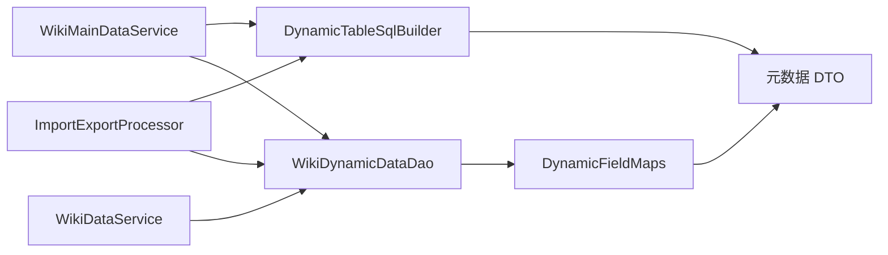

# wiki技术方案

> wiki 模块技术方案文档，对应 `com.wiki.admin.wiki` 包。
> 本文为 wiki 模块动态建表引擎、通用动态查询层、导入导出批处理架构的技术设计。
> 通用流转规范遵循 [业务流转公共规范.md](../../common/业务流转公共规范.md)，不再重复编写。

---

## 0. 文档控制约定

### 0.1 AI 使用约定

- 标题层级和字段名保持稳定
- 所有不确定项写 `TBD`
- 所有不适用项写 `N/A（原因）`
- 所有架构决策显式列出技术选型与权衡
- 每个技术决策必须有唯一 `ARCH ID`

### 0.2 文档版本记录

| 文档版本 | 修改日期 | 修改人 | 修改说明 | 审核人 |
|----------|----------|--------|----------|--------|
| v0.1 | 2026-09-20 | | 初始版本创建 | |

---

## 1. 文档定位与输入依据

### 1.1 事实源策略

- **人类可读设计文档**: 本技术方案文档
- **机器可读契约文件**: N/A
- **同步规则**: 本文档为 wiki 模块技术实现的上游设计，代码实现需与本文档保持一致

### 1.2 事实源优先级

| 优先级 | 文档类型 | 冲突处理规则 |
|--------|----------|--------------|
| P0 | 本技术方案文档 | 架构决策、技术选型、组件设计以本文档为准 |
| P1 | [wiki业务逻辑.md](wiki业务逻辑.md) | 业务流程、权限以业务逻辑文档为准 |
| P2 | [wiki数据库设计.md](wiki数据库设计.md) | 表结构以数据库设计文档为准 |
| P3 | [业务流转公共规范.md](../../common/业务流转公共规范.md) | 后端分层以公共规范为准 |
| P4 | 代码现状 | 实现过程中发现的问题需同步更新本文档 |

### 1.3 适用范围

- **适用系统**: `admin`（后台管理系统）
- **适用包路径**: `com.wiki.admin.wiki`
- **核心技术服务**: wiki 全部业务流程的动态建表、动态查询、批量导入导出

---

## 2. 模块架构总览

### 2.1 包结构

```text
com.wiki.admin.wiki
├─ controller           # WikiMainController / WikiMainDataController / WikiDataController / WikiPageController
├─ service
│  ├─ impl              # WikiMainServiceImpl / WikiMainDataServiceImpl / WikiDataServiceImpl / WikiPageServiceImpl / WikiCRPServiceImpl
│  ├─ webservice         # （预留跨系统调用，首版 N/A）
│  └─ task              # （预留定时任务，首版 N/A）
├─ dao
│  ├─ impl              # WikiMainDaoImpl / WikiMainDataDaoImpl / WikiPageDaoImpl
│  └─ dynamic           # WikiDynamicDataDaoImpl（动态表数据访问，核心）
├─ model
│  ├─ request           # 各请求对象
│  ├─ response          # 各响应对象
│  ├─ dto               # WikiMainDo / WikiMainDataDo / WikiPageDo + 动态表元数据 DTO
│  └─ mapper            # MyBatis Mapper 接口
├─ util                 # WikiConstants / WikiFieldMaps / DynamicTableSqlBuilder / DynamicFieldMaps / ImportExportProcessor
├─ properties          # WikiProperties
└─ resolver            # WikiResolver
```

### 2.2 分层调用方向

```text
Controller
   ↓
WikiCRPService ──→ sys.org IOrgUserService（维护人员校验）
   ↓
WikiMainService / WikiMainDataService / WikiDataService / WikiPageService
   ↓
WikiMainDao / WikiMainDataDao / WikiPageDao（元数据表，MyBatis Mapper）
WikiDynamicDataDao（动态表，动态 SQL）
   ↓
Mapper → DB
```

### 2.3 核心组件依赖



---

## 3. ARCH-W01 动态建表引擎

### 3.1 元数据驱动 DDL 策略

动态表的结构完全由 `wiki_main_data.field_data_json` 元数据驱动，元数据是唯一事实源。建表引擎读取元数据后拼接 `CREATE TABLE` DDL 并执行。

### 3.2 动态表命名规则

```text
wiki_${wikiMain.fieldSimpleName}_${wikiMainData.fieldDataName}
```

- 前缀 `wiki_` 固定
- `${fieldSimpleName}` 来自 `wiki_main`，全局唯一，小写英文和数字
- `${fieldDataName}` 来自 `wiki_main_data`，项目内唯一，小写英文和数字
- 表名字符集约束：`^[a-z0-9_]+$`，由简称校验保证

### 3.3 动态表列结构生成规则

动态表统一包含主键列：

```sql
field_id VARCHAR(32) NOT NULL COMMENT 'id',
PRIMARY KEY (field_id)
```

按数据项类型生成固定列与动态列：

| 数据项类型 | 固定列 | 动态列来源 |
|-----------|--------|-----------|
| `data` 图鉴类 | `field_name` varchar(200)、`field_code` varchar(200) | 数据项明细表每行（排除固定列） |
| `join` 关联项 | 无 | 数据项明细表每行 |
| `doc` 文档类 | `field_name` varchar(200)、`field_code` varchar(200)、`field_context` longblob | N/A（文档类无数据项明细表） |

### 3.4 明细行 → 列映射

数据项明细表每行根据 `type` 映射为物理列：

| type | 物理列 | 列类型 |
|------|--------|--------|
| text | `field_${data_name}` | varchar(200) |
| blob | `field_${data_name}` | longblob |
| number | `field_${data_name}` | decimal(20,4) |
| date | `field_${data_name}` | date |
| datetime | `field_${data_name}` | datetime |
| time | `field_${data_name}` | time |
| boolean | `field_${data_name}` | tinyint |
| enum | `field_${data_name}` | varchar(50) |
| join | `field_${data_name}_id` | varchar(32) |
| attachment | 无独立物理列（存入 `field_data` json） | - |

> 图鉴类固定列 `name`/`code` 生成 `field_name`/`field_code`；文档类固定列额外生成 `field_context`。明细行若 `data_name` 与固定列重名，建表引擎拒绝（校验阶段拦截）。

### 3.5 DDL 生成示例

图鉴类数据项（项目简称 `re9`，数据项简称 `item`，明细含 price/number/desc）：

```sql
CREATE TABLE IF NOT EXISTS `wiki_re9_item` (
    `field_id`    VARCHAR(32) NOT NULL COMMENT 'id',
    `field_name`  VARCHAR(200) COMMENT '名称',
    `field_code`  VARCHAR(200) COMMENT '编号',
    `field_price` DECIMAL(20,4) COMMENT '价格',
    `field_number` DECIMAL(20,4) COMMENT '数量',
    `field_desc`  VARCHAR(200) COMMENT '描述',
    `field_data`  JSON COMMENT '附件等非物理列数据',
    PRIMARY KEY (`field_id`)
) ENGINE=InnoDB DEFAULT CHARSET=utf8mb4 COLLATE=utf8mb4_0900_ai_ci COMMENT='wiki图鉴类数据表';
```

关联项数据项（项目简称 `re9`，数据项简称 `enemy_drop`，明细含 enemy(join re9.monster)/item(join re9.item)）：

```sql
CREATE TABLE IF NOT EXISTS `wiki_re9_enemy_drop` (
    `field_id`        VARCHAR(32) NOT NULL COMMENT 'id',
    `field_enemy_id`  VARCHAR(32) COMMENT '关联: monster',
    `field_item_id`   VARCHAR(32) COMMENT '关联: item',
    `field_data`      JSON COMMENT '附件等非物理列数据',
    PRIMARY KEY (`field_id`)
) ENGINE=InnoDB DEFAULT CHARSET=utf8mb4 COLLATE=utf8mb4_0900_ai_ci COMMENT='wiki关联项数据表';
```

文档类数据项（项目简称 `re9`，数据项简称 `walkthrough`）：

```sql
CREATE TABLE IF NOT EXISTS `wiki_re9_walkthrough` (
    `field_id`      VARCHAR(32) NOT NULL COMMENT 'id',
    `field_name`    VARCHAR(200) COMMENT '标题',
    `field_code`    VARCHAR(200) COMMENT '编号',
    `field_context` LONGBLOB COMMENT '内容',
    PRIMARY KEY (`field_id`)
) ENGINE=InnoDB DEFAULT CHARSET=utf8mb4 COLLATE=utf8mb4_0900_ai_ci COMMENT='wiki文档类数据表';
```

### 3.6 DynamicTableSqlBuilder 组件

- **职责**：根据 `wiki_main`（简称）+ `wiki_main_data`（简称、类型、明细 json）生成 DDL 语句
- **位置**：`com.wiki.admin.wiki.util.DynamicTableSqlBuilder`
- **输入**：`WikiMainDo`、`WikiMainDataDo`（含已解析的明细列表）
- **输出**：`CREATE TABLE` / `ALTER TABLE ADD COLUMN` / `DROP TABLE` SQL 字符串
- **纯函数**：不依赖业务层 / DB，仅做字符串拼接与校验
- **安全**：表名、列名经白名单正则校验（`^[a-z0-9_]+$`），列类型由枚举映射，杜绝 SQL 注入

### 3.7 DDL 执行策略

- DDL 由 `WikiMainDataServiceImpl` 在 `save` / `update` / `delete` 事务中调用 `WikiDynamicDataDao` 执行
- DDL 不走 MyBatis Mapper XML（动态表无固定 Mapper），通过 `SqlSession` 直接执行原生 SQL
- 执行前校验表名合法性；执行失败回滚事务并抛业务异常
- `ALTER TABLE` 仅支持 `ADD COLUMN`（首版约束，保护存量数据）

### 3.8 表存在性校验

- 建表前查询 `information_schema.tables` 确认表不存在（防重复建表）
- 删表前确认表存在
- 数据操作前确认表存在，不存在抛 `NOT_FOUND`

---

## 4. ARCH-W02 通用动态查询层

### 4.1 动态 FieldMaps 白名单

静态表的查询字段白名单（如 `AttachmentFieldMaps`）在编译期确定；动态表的列由元数据运行时决定，需在运行时由元数据构建白名单。

### 4.2 DynamicFieldMaps 组件

- **职责**：根据数据项元数据（明细列表）构建 `Java 属性名 → 数据库列名` 白名单
- **位置**：`com.wiki.admin.wiki.util.DynamicFieldMaps`
- **输入**：`WikiMainDataDo`（含已解析的明细列表 + 固定列）
- **输出**：`Map<String, String>`（如 `{"fieldName": "field_name", "fieldCode": "field_code", "fieldPrice": "field_price"}`）
- **复用**：构建结果直接传入 `QueryConditionBuilder.build(root, fieldColumnMap)` 与 `SqlSortBuilder.buildOrderBy(...)`
- **安全**：列名经白名单正则校验，未在白名单中的字段查询抛 `BAD_REQUEST`

### 4.3 WikiDynamicDataDao 接口

```text
WikiDynamicDataDao（接口）
├─ void executeDdl(String sql)                              // 执行 DDL
├─ boolean tableExists(String tableName)                    // 表存在性校验
├─ long countByCondition(String tableName, String whereSql, Map params)
├─ List<Map<String,Object>> selectByCondition(String tableName, String columns, String whereSql, String orderBySql, long offset, int pageSize, boolean needPage, Map params)
├─ int insert(String tableName, Map<String,Object> row)
├─ int update(String tableName, String id, Map<String,Object> row)
├─ int deleteById(String tableName, String id)
├─ int batchInsert(String tableName, List<Map<String,Object>> rows)
└─ int batchDeleteByIds(String tableName, List<String> ids)
```

- **实现**：`WikiDynamicDataDaoImpl`，通过 `SqlSession` 执行原生 SQL，不走 Mapper XML
- **参数绑定**：所有值通过 MyBatis `#{paramN}` 命名参数绑定，杜绝 SQL 注入
- **表名 / 列名**：经 `DynamicTableSqlBuilder` / `DynamicFieldMaps` 白名单校验后拼接，不直接接受外部输入

### 4.4 查询流程

```text
前端 query.data（标准查询树）
   ↓
WikiDataService.list(fieldDataId, apiRequest)
   ↓ 加载数据项元数据 → DynamicFieldMaps 构建白名单
   ↓ QueryConditionBuilder.build(root, fieldColumnMap) → whereSql + params
   ↓ SqlSortBuilder.buildOrderBy(...) → orderBySql
   ↓ WikiDynamicDataDao.selectByCondition(tableName, columns, whereSql, orderBySql, ...)
   ↓ 返回 List<Map<String,Object>>（或映射为 VO）
```

### 4.5 关联项查询的特殊处理

关联项列表筛选区需按关联数据模糊筛选（关联数据的 `field_name` 或 `field_code`），这需要联表查询目标数据项的动态表。

- **方案**：`WikiDynamicDataDao.selectByCondition` 支持 `joinClauses` 参数，根据关联明细动态拼接 `LEFT JOIN wiki_${targetTable} ON base.field_${dataName}_id = target.field_id`
- **列名前缀**：关联查询时列名需携带表别名前缀（如 `base.field_name`、`t1.field_name AS enemy_name`），由 `DynamicFieldMaps` 在联表场景下生成带前缀的白名单

---

## 5. ARCH-W03 数据维护 CRUD 架构

### 5.1 三类型统一入口

数据维护接口以 `fieldDataId`（数据项 id）为入口参数，后端加载数据项元数据后根据 `field_data_type` 分发处理：

```text
WikiDataController.list/save/update/delete(fieldDataId, ...)
   ↓
WikiResolver.requireMaintain(fieldDataId)  // 双层鉴权
   ↓
WikiDataService.list/save/update/delete(fieldDataId, ...)
   ↓ 加载 WikiMainData（元数据）
   ↓ 根据 field_data_type 分发
   ├─ data  → 图鉴类逻辑（固定 name/code + 动态列）
   ├─ join  → 关联项逻辑（动态 join 列）
   └─ doc   → 文档类逻辑（固定 name/code/context）
```

### 5.2 数据 VO 映射

动态表查询结果为 `Map<String, Object>`，需映射为前端可消费的 VO：

- **固定列**：映射为 VO 的强类型字段（`fieldName`、`fieldCode`、`fieldContext`）
- **动态列**：映射为 VO 的 `fieldData`（Map<String, Object>，存储所有动态列值）
- **附件类明细**：存储在 `field_data` json 中，VO 中以附件 id 列表形式返回

### 5.3 列表列控制

- 图鉴类/文档类列表：显示名称、编号（固定列）
- 关联项列表：显示所有数据明细字段（长文本除外），由元数据决定显示哪些列

---

## 6. ARCH-W04 批量导入导出架构

### 6.1 导入导出范围

仅关联项（`join`）数据项支持批量导入导出，图鉴类与文档类不支持。

### 6.2 ImportExportProcessor 组件

- **职责**：处理 xlsx 模板生成、文件解析、数据校验、分批导入、导出
- **位置**：`com.wiki.admin.wiki.util.ImportExportProcessor`
- **依赖**：`DynamicTableSqlBuilder`（生成列名）、`WikiDynamicDataDao`（批量写入）、Apache POI（xlsx 读写）

### 6.3 模板下载

```text
ImportExportProcessor.buildTemplate(WikiMainDataDo)
   ↓ 读取数据项明细列表
   ↓ 过滤附件类明细（不列出）
   ↓ 关联数据列标题显示 "${关联目标数据项名称}编号"
   ↓ 生成 xlsx 首行标题行
   ↓ 返回 byte[] / 写入响应流
```

### 6.4 导入处理流程

```text
ImportExportProcessor.import(WikiMainDataDo, MultipartFile, skipFail, skipError)
   ↓ 1. 读取 xlsx（POI），失败抛 BAD_REQUEST
   ↓ 2. 逐行解析为 List<Map<String,Object>>（按模板列名映射）
   ↓ 3. 数据合理性校验（必填、类型、枚举值、关联数据存在性）
   ↓    ├─ 不合理 + 未选 skipError → 抛 BAD_REQUEST（含错误明细）
   ↓    └─ 不合理 + 选 skipError → 移除异常项
   ↓ 4. 关联数据校验：join 类明细值需能在目标动态表 field_code 中找到
   ↓ 5. 分批 batchInsert，每批 200 条
   ↓    ├─ 失败 + 未选 skipFail → 回滚（REQUIRES_NEW 内层事务），抛 INTERNAL_ERROR
   ↓    └─ 失败 + 选 skipFail → 移除失败项，继续
   ↓ 6. 返回导入结果（成功数、跳过数、失败明细）
```

### 6.5 事务策略

- 导入主流程由 `WikiDataServiceImpl.import` 标注 `@Transactional(rollbackFor = Exception.class)`
- 每批次 200 条作为一个独立插入单元
- 未选"失败数据跳过"时：任一批次失败触发整体回滚
- 选"失败数据跳过"时：失败批次移除，不触发整体回滚；已成功批次保留
- 批次事务边界：使用 `TransactionTemplate` 编程式事务控制每批独立提交/回滚，避免长事务

### 6.6 导出处理流程

```text
ImportExportProcessor.export(WikiMainDataDo)
   ↓ 1. 全量查询动态表数据
   ↓ 2. 按模板列名顺序生成 xlsx
   ↓ 3. 关联数据列显示目标记录的 field_code 值
   ↓ 4. 附件类明细不导出
   ↓ 5. 返回 byte[]
```

### 6.7 附件组件复用

导入文件上传复用既有附件组件（`AttachmentUploader.vue` + `/api/v1/admin/attachment/upload`）：

- 前端通过附件组件上传 xlsx 文件，获得附件 id
- 前端将附件 id + 跳过开关提交到导入接口
- 后端通过 `IAdminAttachmentService` 下载附件文件流并解析
- 附件 `field_model_name` = `${项目简称}::${数据项简称}`，`field_key` = "import"

---

## 7. ARCH-W05 跨模块调用架构

### 7.1 调用 sys.org 模块

wiki 模块维护人员校验需查询用户信息，通过 `WikiCRPService` 调用 `sys.org` 模块：

```text
WikiResolver.requireMaintain(fieldMainId)
   ↓ 加载 wiki_main → 获取 field_managers
   ↓ WikiCRPService → IOrgUserService（sys.org）
   ↓ 校验当前用户是否在维护人员列表 且 用户有效
```

- **约束**：禁止 wiki 模块直接访问 `admin_org_user` 表
- **跨模块调用参数**：传递 `Dto` / `Request`，禁止传递 `Do`
- **异常**：由 `WikiCRPService` 统一捕获并封装为业务异常

### 7.2 调用 sys.attachment 模块

导入文件读取通过 `WikiCRPService` 调用 `sys.attachment` 模块：

```text
WikiDataServiceImpl.import(attachmentId, ...)
   ↓ WikiCRPService → IAdminAttachmentService（sys.attachment）
   ↓ loadForDownload(attachmentId) → 获取文件路径
   ↓ 读取文件流 → ImportExportProcessor 解析
```

### 7.3 CRPService 设计

- **接口**：`IWikiCRPService`
- **实现**：`WikiCRPServiceImpl`
- **职责**：封装跨模块调用（sys.org 用户校验、sys.attachment 文件读取），做参数校验与异常封装
- **禁止**：承载业务逻辑、直接访问 Dao

---

## 8. ARCH-W06 事务与异常策略

### 8.1 事务边界

| 操作 | 事务声明 | 传播策略 |
|------|----------|----------|
| 项目 CRUD | `WikiMainServiceImpl` `@Transactional` | REQUIRED |
| 数据项新建 | `WikiMainDataServiceImpl` `@Transactional` | REQUIRED（含 DDL 执行） |
| 数据项删除 | `WikiMainDataServiceImpl` `@Transactional` | REQUIRED（含 DROP TABLE） |
| 数据明细 CRUD | `WikiDataServiceImpl` `@Transactional` | REQUIRED |
| 批量导入 | `WikiDataServiceImpl` 主事务 + 批次 `TransactionTemplate` | 批次独立提交 |
| wiki 页面配置 | `WikiPageServiceImpl` `@Transactional` | REQUIRED |

> **DDL 事务约束**：MySQL 的 DDL（CREATE/ALTER/DROP TABLE）会隐式提交当前事务，无法回滚。因此数据项新建的 DDL 执行与元数据插入需保证：先插入元数据，DDL 执行失败时需手动删除元数据记录（补偿）；删表前先删元数据，删表失败需回滚元数据删除。

### 8.2 异常处理

遵循 [业务流转公共规范.md](../../common/业务流转公共规范.md) 4.8，本模块特有：

- DDL 执行异常由 `WikiDynamicDataDaoImpl` 抛出，`WikiMainDataServiceImpl` 捕获并转换为 `BusinessException(INTERNAL_ERROR)`
- 动态查询白名单校验失败抛 `BusinessException(BAD_REQUEST, "不支持的字段")`
- 跨模块调用异常由 `WikiCRPServiceImpl` 统一封装

### 8.3 审计

- 写操作（项目/数据项/数据明细增删改）统一记录审计日志，由 `sys.audit` 模块承载
- wiki 模块通过事件或 `CRPService` 调用审计模块，不直接写审计表
- 审计字段：操作人、操作时间、接口标识、文档 ID（项目 id / 数据项 id）、操作前后快照

---

## 9. ARCH-W07 前端架构

### 9.1 API 封装

- 新增 `src/api/wiki.js`，基于 `createStandardApi` 工厂生成标准接口集
- 模块路径：`/wiki`（项目）、`/wiki/data`（数据项）、`/wiki/data-item`（数据明细）、`/wiki/page`（wiki 页面）
- 非标准接口（导入/模板下载）单独声明

### 9.2 路由

```text
admin/wiki                  → 项目列表
admin/wiki/create           → 项目新建
admin/wiki/edit/:id         → 项目编辑
admin/wiki/:mainId/data     → 数据项列表
admin/wiki/:mainId/data/create → 数据项新建
admin/wiki/:mainId/data/edit/:id → 数据项编辑
admin/wiki/data-item/:dataId   → 数据维护（按类型动态路由）
admin/wiki/page/:dataId     → wiki 页面维护
```

### 9.3 动态表单

- 数据项新建/编辑页：数据项明细表为动态行组件，类型选择联动第四列（枚举项/关联项）
- 数据维护新建/编辑页：根据数据项元数据动态渲染表单项，类型决定控件（文本输入/数字输入/日期选择/富文本/附件上传/下拉选择）
- 关联项选择控件：下拉选择源来自目标数据项动态表的 `field_name` + `field_id`

### 9.4 导入弹窗

- 复用 `AttachmentUploader.vue` 上传 xlsx
- 中间区域显示复选框：失败数据跳过、异常数据跳过
- 提交后展示导入结果（成功数、跳过数、失败明细）

---

## 10. 文档同步清单

| 变更项 | 需要同步的文档/契约 | 动作 |
|--------|----------------------|------|
| 动态建表规则变化 | [wiki数据库设计.md](wiki数据库设计.md) | 新增/更新 |
| 架构决策变化 | 本文档 | 新增/更新 |
| 接口路径变化 | [wikiAPI接口设计文档.md](wikiAPI接口设计文档.md) | 新增/更新 |
| 业务流程变化 | [wiki业务逻辑.md](wiki业务逻辑.md) | 新增/更新 |
| 跨模块调用变化 | [业务流转公共规范.md](../../common/业务流转公共规范.md) | 新增/更新 |
