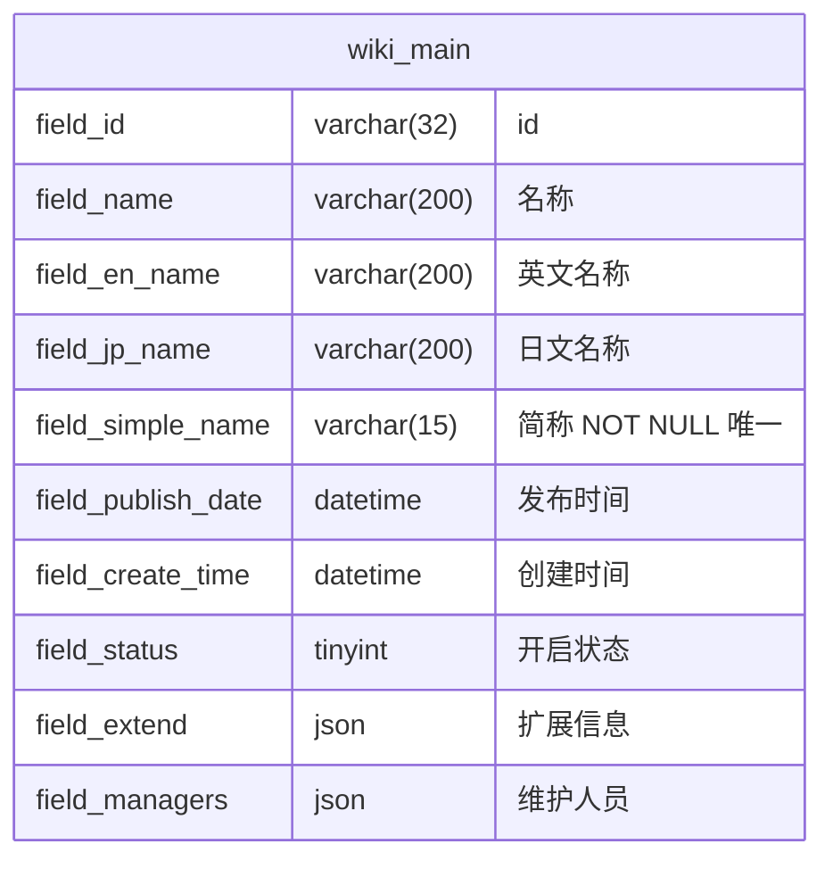
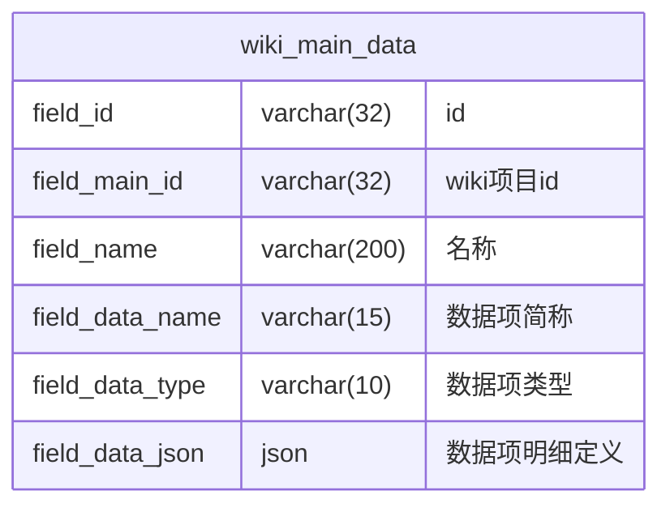
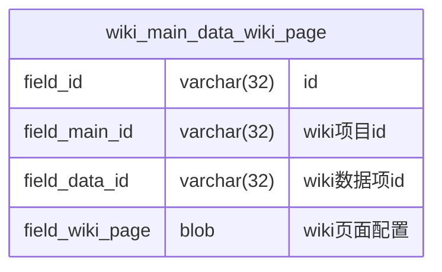

# wiki数据库设计

> wiki 模块数据库设计文档，对应 `com.wiki.admin.wiki` 包。
> 通用规范遵循 [数据库公共规范.md](../../common/数据库公共规范.md)，不再重复编写。
> 表结构、字段、索引以本文档为准。

---

## 0. 文档控制约定

### 0.1 AI 使用约定

- 标题层级和字段名保持稳定
- 所有不确定项写 `TBD`
- 所有不适用项写 `N/A（原因）`
- 所有表、字段、索引、外键约束显式列出
- 每个表必须有唯一 `TBL ID`

### 0.2 文档版本记录

| 文档版本 | 修改日期 | 修改人 | 修改说明 | 审核人 |
|----------|----------|--------|----------|--------|
| v0.1 | 2026-09-20 | | 初始版本创建 | |

---

## 1. 文档定位与输入依据

### 1.1 事实源策略

- **人类可读设计文档**: 本数据库设计文档
- **机器可读契约文件**: Flyway 迁移脚本
- **同步规则**: 本文档为表结构上游设计，Flyway 迁移脚本与代码实现需与本文档保持一致

### 1.2 事实源优先级

| 优先级 | 文档类型 | 冲突处理规则 |
|--------|----------|--------------|
| P0 | 本数据库设计文档 | 表结构、字段、索引以本文档为准 |
| P1 | [wiki业务逻辑.md](wiki业务逻辑.md) | 业务流程、权限以业务逻辑文档为准 |
| P2 | [wiki技术方案.md](wiki技术方案.md) | 动态建表规则以技术方案为准 |
| P3 | [数据库公共规范.md](../../common/数据库公共规范.md) | 公共字段、命名以公共规范为准 |
| P4 | 代码现状 | 实现过程中发现的问题需同步更新本文档 |

### 1.3 适用范围

- **适用系统**: `admin`（后台管理系统）
- **数据库**: MySQL 8.0+，`utf8mb4_0900_ai_ci` 编码
- **表命名**: 遵循 [数据库公共规范.md](../../common/数据库公共规范.md)，`wiki_` 前缀为模块标识

---

## 2. 表目录

### 2.1 元数据表（Flyway 管理固定结构）

| 表名 | 中文名 | TBL ID | 说明 |
|------|--------|--------|------|
| `wiki_main` | wiki 项目表 | TBL-W01 | wiki 项目主表 |
| `wiki_main_data` | wiki 项目数据项表 | TBL-W02 | 项目下数据项定义，驱动动态建表 |
| `wiki_main_data_wiki_page` | wiki 数据项页面配置表 | TBL-W03 | 数据项的 wiki 展示配置 |

### 2.2 动态表（运行时由建表引擎生成）

动态表命名规则：`wiki_${fieldSimpleName}_${fieldDataName}`，表结构由数据项类型 + 明细定义驱动。本文档定义动态表结构模板，实际表结构运行时生成。详见第 4 节。

---

## 3. 元数据表设计

### 3.1 TBL-W01 wiki_main（wiki 项目表）



| 字段 | 类型 | NULL | 默认值 | 说明 |
|------|------|------|--------|------|
| `field_id` | varchar(32) | NOT NULL | | 主键 |
| `field_name` | varchar(200) | | | 名称 |
| `field_en_name` | varchar(200) | | | 英文名称 |
| `field_jp_name` | varchar(200) | | | 日文名称 |
| `field_simple_name` | varchar(15) | NOT NULL | | 简称，全局唯一，限小写英文和数字，作为动态表名前缀 |
| `field_publish_date` | datetime | | | 发布时间 |
| `field_create_time` | datetime | | | 创建时间 |
| `field_status` | tinyint | NOT NULL | 1 | 开启状态（1 开启 / 0 停用） |
| `field_extend` | json | | | 扩展信息，存储拓展信息明细行数组 `[{name, type, value}]` |
| `field_managers` | json | | | 维护人员，存储 AdminOrgUser id 数组 `["userId1", "userId2"]` |

**索引**：

| 索引名 | 类型 | 字段 | 说明 |
|--------|------|------|------|
| `PRIMARY` | 主键 | `field_id` | |
| `uk_wiki_main_simple_name` | 唯一 | `field_simple_name` | 简称全局唯一 |

### 3.2 TBL-W02 wiki_main_data（wiki 项目数据项表）



| 字段 | 类型 | NULL | 默认值 | 说明 |
|------|------|------|--------|------|
| `field_id` | varchar(32) | NOT NULL | | 主键 |
| `field_main_id` | varchar(32) | | | 所属 wiki 项目 id（关联 `wiki_main.field_id`） |
| `field_name` | varchar(200) | | | 数据项名称 |
| `field_data_name` | varchar(15) | NOT NULL | | 数据项简称，项目内唯一，限小写英文和数字，作为动态表名后缀 |
| `field_data_type` | varchar(10) | NOT NULL | | 数据项类型（`data` 图鉴类 / `join` 关联项 / `doc` 文档类） |
| `field_data_json` | json | | | 数据项明细定义，驱动动态建表，结构见 3.2.1 |

**索引**：

| 索引名 | 类型 | 字段 | 说明 |
|--------|------|------|------|
| `PRIMARY` | 主键 | `field_id` | |
| `idx_wiki_main_data_main` | 普通 | `field_main_id` | 按项目查询数据项 |
| `uk_wiki_main_data_name` | 唯一 | (`field_main_id`, `field_data_name`) | 数据项简称项目内唯一 |

#### 3.2.1 field_data_json 结构

存储数据项明细定义数组，每行对应动态表一列：

```json
[
  {
    "name": "名称（显示名）",
    "dataName": "price（生成列名 field_price）",
    "type": "number（数据类型）",
    "enums": ["可选值1", "可选值2"],
    "join": "目标数据项id（仅 type=join）"
  }
]
```

| 字段 | 类型 | 必填 | 说明 |
|------|------|------|------|
| `name` | string | 是 | 明细列显示名 |
| `dataName` | string | 是 | 简称，限英文/数字/字符，生成列名 `field_${dataName}` |
| `type` | string | 是 | 数据类型，见 [wiki业务逻辑.md](wiki业务逻辑.md) 4.3 |
| `enums` | string[] | 否 | 枚举项，仅 `type=enum` |
| `join` | string | 否 | 关联目标数据项 id，仅 `type=join` |

> 图鉴类固定列 `name`（名称）、`code`（编号）由后端自动补充到此 json 前部，前端不传。

### 3.3 TBL-W03 wiki_main_data_wiki_page（wiki 数据项页面配置表）



| 字段 | 类型 | NULL | 默认值 | 说明 |
|------|------|------|--------|------|
| `field_id` | varchar(32) | NOT NULL | | 主键 |
| `field_main_id` | varchar(32) | | | 所属 wiki 项目 id |
| `field_data_id` | varchar(32) | NOT NULL | | 数据项 id（关联 `wiki_main_data.field_id`） |
| `field_wiki_page` | blob | | | wiki 页面配置 json，结构见 3.3.1 |

**索引**：

| 索引名 | 类型 | 字段 | 说明 |
|--------|------|------|------|
| `PRIMARY` | 主键 | `field_id` | |
| `uk_wiki_page_data_id` | 唯一 | `field_data_id` | 一个数据项对应一份配置 |

#### 3.3.1 field_wiki_page 结构

```json
{
  "displayInfos": [
    {"type": "self", "fieldDataId": "数据项id", "fields": ["fieldName", "fieldCode", "fieldPrice"]}
  ],
  "displayFields": [
    {"fieldDataId": "关联项id", "fields": ["fieldName", "fieldCode"]}
  ]
}
```

| 字段 | 类型 | 说明 |
|------|------|------|
| `displayInfos` | array | 显示信息项列表，`type=self` 为本数据项明细，`type=join` 为包含该数据项的关联类数据项 |
| `displayInfos[].fields` | string[] | 显示的字段列表（数据明细项简称） |
| `displayFields` | array | 显示字段项列表，选择"关联类"数据项时按序选择要显示的数据明细项 |
| `displayFields[].fieldDataId` | string | 关联类数据项 id |
| `displayFields[].fields` | string[] | 要显示的关联类数据项数据明细项 |

---

## 4. 动态表结构模板

动态表运行时由建表引擎生成，表结构由数据项类型 + 明细定义驱动。本节定义各类型动态表的结构模板。

### 4.1 图鉴类（data）动态表模板

```sql
CREATE TABLE IF NOT EXISTS `wiki_${fieldSimpleName}_${fieldDataName}` (
    `field_id`      VARCHAR(32) NOT NULL COMMENT 'id',
    `field_name`    VARCHAR(200) COMMENT '名称',
    `field_code`    VARCHAR(200) COMMENT '编号',
    -- 动态列：由 field_data_json 明细生成，每行一列
    `field_${dataName}` <列类型> COMMENT '${name}',
    -- ...
    `field_data`    JSON COMMENT '附件等非物理列数据',
    PRIMARY KEY (`field_id`)
) ENGINE=InnoDB DEFAULT CHARSET=utf8mb4 COLLATE=utf8mb4_0900_ai_ci COMMENT='wiki图鉴类数据表';
```

**固定列**：

| 列名 | 类型 | 说明 |
|------|------|------|
| `field_id` | varchar(32) NOT NULL | 主键 |
| `field_name` | varchar(200) | 名称（固定） |
| `field_code` | varchar(200) | 编号（固定） |
| `field_data` | json | 附件类明细数据（无附件明细时仍保留此列） |

**动态列**：由 `field_data_json` 中排除 `name`/`code` 固定列后的每行明细生成，列名 `field_${dataName}`，列类型由 `type` 映射（见 [wiki技术方案.md](wiki技术方案.md) 3.4）。

### 4.2 关联项（join）动态表模板

```sql
CREATE TABLE IF NOT EXISTS `wiki_${fieldSimpleName}_${fieldDataName}` (
    `field_id`          VARCHAR(32) NOT NULL COMMENT 'id',
    -- 动态列：由 field_data_json 明细生成，type=join 生成 field_${dataName}_id
    `field_${dataName}_id` VARCHAR(32) COMMENT '${name}',
    -- ...
    `field_data`        JSON COMMENT '附件等非物理列数据',
    PRIMARY KEY (`field_id`)
) ENGINE=InnoDB DEFAULT CHARSET=utf8mb4 COLLATE=utf8mb4_0900_ai_ci COMMENT='wiki关联项数据表';
```

**固定列**：

| 列名 | 类型 | 说明 |
|------|------|------|
| `field_id` | varchar(32) NOT NULL | 主键 |
| `field_data` | json | 附件类明细数据 |

> 关联项无 `field_name`、`field_code` 固定列。

**动态列**：`type=join` 的明细生成 `field_${dataName}_id` varchar(32)；其他类型生成对应列。

### 4.3 文档类（doc）动态表模板

```sql
CREATE TABLE IF NOT EXISTS `wiki_${fieldSimpleName}_${fieldDataName}` (
    `field_id`      VARCHAR(32) NOT NULL COMMENT 'id',
    `field_name`    VARCHAR(200) COMMENT '标题',
    `field_code`    VARCHAR(200) COMMENT '编号',
    `field_context` LONGBLOB COMMENT '内容',
    PRIMARY KEY (`field_id`)
) ENGINE=InnoDB DEFAULT CHARSET=utf8mb4 COLLATE=utf8mb4_0900_ai_ci COMMENT='wiki文档类数据表';
```

**固定列**：

| 列名 | 类型 | 说明 |
|------|------|------|
| `field_id` | varchar(32) NOT NULL | 主键 |
| `field_name` | varchar(200) | 标题 |
| `field_code` | varchar(200) | 编号 |
| `field_context` | longblob | 内容（富文本正文） |

> 文档类无数据项明细表，无动态列，无 `field_data` 列。

### 4.4 数据类型 → 列类型映射

| 数据类型 | MySQL 列类型 |
|----------|-------------|
| text | varchar(200) |
| blob | longblob |
| number | decimal(20,4) |
| date | date |
| datetime | datetime |
| time | time |
| boolean | tinyint |
| enum | varchar(50) |
| join | varchar(32)（列名 `field_${dataName}_id`） |
| attachment | 无物理列（存入 `field_data` json） |

### 4.5 动态表索引策略

动态表仅主键索引，不自动创建其他索引。

> **TBD**：是否根据明细定义自动创建索引（如关联列 `field_${dataName}_id` 建立普通索引以优化关联查询性能）。首版不创建，性能问题出现时通过 `ALTER TABLE` 补充。

---

## 5. Flyway 迁移脚本规划

### 5.1 元数据表迁移

| 脚本名 | 说明 |
|--------|------|
| `V1_0__3__create_wiki_tables.sql` | 创建 `wiki_main`、`wiki_main_data`、`wiki_main_data_wiki_page` 三张元数据表 |

### 5.2 动态表迁移

动态表不通过 Flyway 管理，运行时由建表引擎执行 DDL 生成。建表引擎需保证幂等（`CREATE TABLE IF NOT EXISTS`）。

### 5.3 权限配置

`roles.yml` 新增权限码 `admin-wiki::ADMIN`，放置于 `resources/wiki/roles.yml`。

---

## 6. 文档同步清单

| 变更项 | 需要同步的文档/契约 | 动作 |
|--------|----------------------|------|
| 表结构 / 字段变化 | Flyway 迁移脚本 | 新增/更新 |
| 动态表结构模板变化 | [wiki技术方案.md](wiki技术方案.md) | 新增/更新 |
| 数据项类型 / 固定列变化 | [wiki业务逻辑.md](wiki业务逻辑.md) | 新增/更新 |
| 索引策略变化 | 本文档 | 新增/更新 |
| 接口报文字段变化 | [wikiAPI接口设计文档.md](wikiAPI接口设计文档.md) | 新增/更新 |