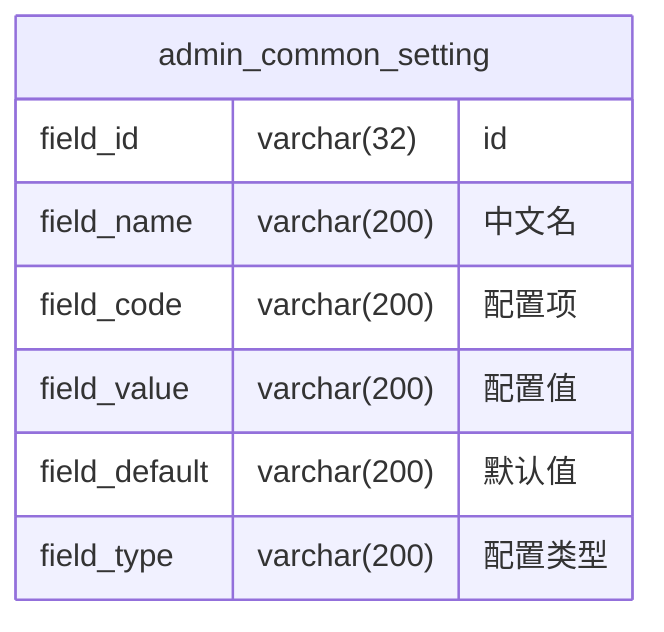

# 公共服务

## 配置表

### 表结构

```mermaid
erDiagram
    admin_common_setting {
        field_id varchar(32) "id"
        field_name varchar(200) "中文名"
        field_code varchar(200) "配置项"
        field_value varchar(200) "配置值"
        field_default varchar(200) "默认值"
        field_type varchar(200) "配置类型"
    }
```

### 业务

1. 服务启动时，读取各个 `setting.yml` 文档的 `SETTING` 配置项，增量插入 `admin_common_setting` 表；
2. 各个模块独立维护和使用自己的配置项信息