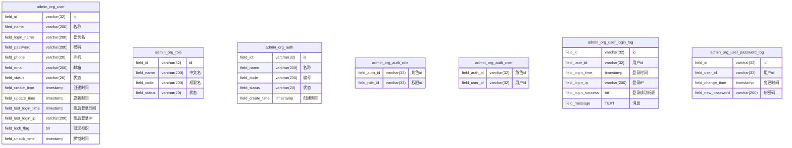

# 用户和权限管理

> 用户与权限管理归属于 `org` 包；模块标识 `admin-org`；模块名称 `用户与权限模块`；

## 表结构



## 权限

| 权限名              | 中文名      | 描述                  |
|------------------|----------|---------------------|
| admin-org::USER | 用户管理员 | 添加、修改、操作用户          |
| admin-org::ROLE | 角色管理员 | 添加、修改、操作角色          |

## 页面

### 菜单栏

```
主菜单
 L 用户与权限
   L 用户
   L 角色
   L 权限
   L 登录记录
   L 系统配置
```

### 用户列表页面（主菜单-用户与权限-用户）

筛选区：名称（like）、状态、锁定标识

排序：创建时间（默认降序）

操作：新建（`admin-org::USER`权限）

列表显示：名称、登录名、手机号（脱敏）、邮箱（脱敏）、创建时间、状态、锁定标识、操作（查看、编辑、停用/启用、解除锁定）（所有按钮需要 `admin-org::USER` 权限）

### 用户新建/编辑页面

表单：名称（必填）、登录名（必填）、手机号、邮箱

校验：登录名、手机号、邮箱不能重复；登录名不可为手机号（纯数字）或邮箱（带'@'）格式

### 用户详情页面

表单：名称、登录名、手机号、邮箱、状态、创建时间、更新时间、最后登录时间、最后登录IP、锁定标识、解锁时间

明细表：用户登录记录；显示登录时间、登录IP、登录成功标识、消息；固定按登录时间降序排序；分页；

### 角色列表页面（主菜单-用户与权限-角色）

筛选区：名称（like）、编号（like）、状态

排序：创建时间（默认降序）

操作：新建（`admin-org::ROLE`权限）

列表显示：名称、编号、状态、创建时间、操作（查看、编辑、停用/启用）（所有按钮需要 `admin-org::ROLE` 权限）

### 角色新建/编辑页面

表单：名称（必填）、编号（必填）、权限（占整行）、用户（占整行）

### 角色详情页面

表单：名称、编号、状态、权限（占整行）、用户（占整行）、创建时间、更新时间

### 权限列表页面（主菜单-用户与权限-权限）

筛选区：权限名（like）、状态

排序：无

操作：无

列表显示：中文名、权限名

### 登录记录列表页面（主菜单-用户与权限-登录记录）

筛选区：用户（like）、登录时间、登录IP、登录成功标识

排序：登录时间（默认降序）

列表显示：用户、登录时间、登录IP、登录成功标识、消息

### 系统配置页面（主菜单-用户与权限-系统配置）

用户与权限管理配置项：

| 配置项 | 中文名 | 默认值   | 描述                                     |
|--------|--------|-------|----------------------------------------|
| admin-org::change-password-expire-days | 密码有效期 | 0     | 密码有效期，为 0 时表示不过期，过期时用户登录后强制进行修改密码，单位：天 |
| admin-org::password-min-length | 密码最小长度 | 6     | 密码最小长度                                 |
| admin-org::password-not-equal-time | 密码不能相同 | false | 密码不能相同，开启后用户不可设定与历史密码相同的密码 |
| admin-org::lock-login-fail-times | 登录失败锁定次数 | 5     | 登录失败锁定次数，为 0 时表示不锁定             |
| admin-org::default_password | 默认密码 | 123456 | 默认密码                                   |

## 业务逻辑

1. 服务启动时，在数据库脚本后，检查并新建默认用户 `admin`：field_id = "0".repeat(32); field_name = "管理员"; field_login_name = "admin";
2. admin用户检查后，读取所有模块的 `ROLE.yml` 文件，读取权限信息增量保存到 `admin_org_role` 表中；
3. 权限信息检查后，检查并新建默认角色 `"0".repeat(32)/系统管理员/sys_admin`；并默认赋值所有权限，和 `admin` 用户给该角色；
4. 管理员用户被不可编辑、系统管理员角色的权限分配和管理员用户分配，不可被修改；
5. 页面顶部栏右侧提供 "修改密码" 按钮，弹窗二次输入密码对当前用户密码进行修改；保存修改后自动登出；
6. 密码在数据库内使用 BCrypt 进行加密管理；