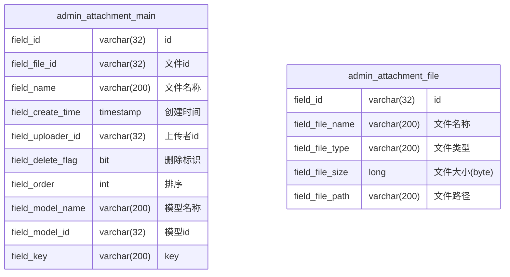

# 附件机制

> 本机制模块标识 `admin-attachment`

## 表结构



## 权限

| 权限名                     | 中文名 | 描述              |
|-------------------------| --- |-----------------|
| admin-attachment::ADMIN | 附件管理员 | 可以查看附件列表和维护公共配置 |

## 接口鉴权约定

各接口的接口级鉴权规则如下（Resolver 以权限码作为接口标识、fieldId 作为文档 ID，校验通过后记录可追踪鉴权审计日志）：

| 接口 | 方法 | 鉴权规则 |
| --- | --- | --- |
| 列表查询 `/list` | POST | 仅要求登录态，不做权限过滤 |
| 上传 `/upload` | POST | 仅要求登录态，不做权限过滤 |
| 下载 `/download` | GET | 仅要求登录态，不做权限过滤 |
| 删除 `/delete` | DELETE | 限制为**上传者本人**或具备 `admin-attachment::ADMIN` 的用户 |

## 页面

### 菜单栏

```text
主菜单
  L 附件
    L 附件列表
    L 系统配置
```

### 附件列表页面（主菜单-附件）

筛选区：文件名称（like），模型名称（like），上传者（地址本）

排序：创建时间降序

操作：无

列表：文件名称、模型名称、模型id、key、上传者、文件大小、文件路径、删除标志；

### 系统配置页面（主菜单-附件-系统配置）

| 配置项 | 中文名 | 默认值           | 描述                 |
|--------| ------ |---------------|--------------------|
| admin-attachment::file_path | 附件路径 | '/attachment' |                    |
| admin-attachment::file_size_limit | 附件大小限制 | 10485760 | 单位：byte；为 0 时表示不限制 |

## 业务逻辑

### 附件关联

通过 field_model_name、field_model_id、field_key 三个字段关联

如：系统图标：field_model_name = "system", field_model_id = null, field_key = "system_icon"；

用户头像：field_model_name = "user", field_model_id = 用户id, field_key = "avatar"；

对于 wiki 项目内的附件，field_model_name 保存 `项目简称::数据项简称`；如："re9::item", "ff8::skill"

### 附件保存路径

> `${admin-attachment::file_path}/${year}/${month}/${AdminAttachmentFile.fieldId}`

以 `AdminAttachmentFile.filedId` 为文件名保存